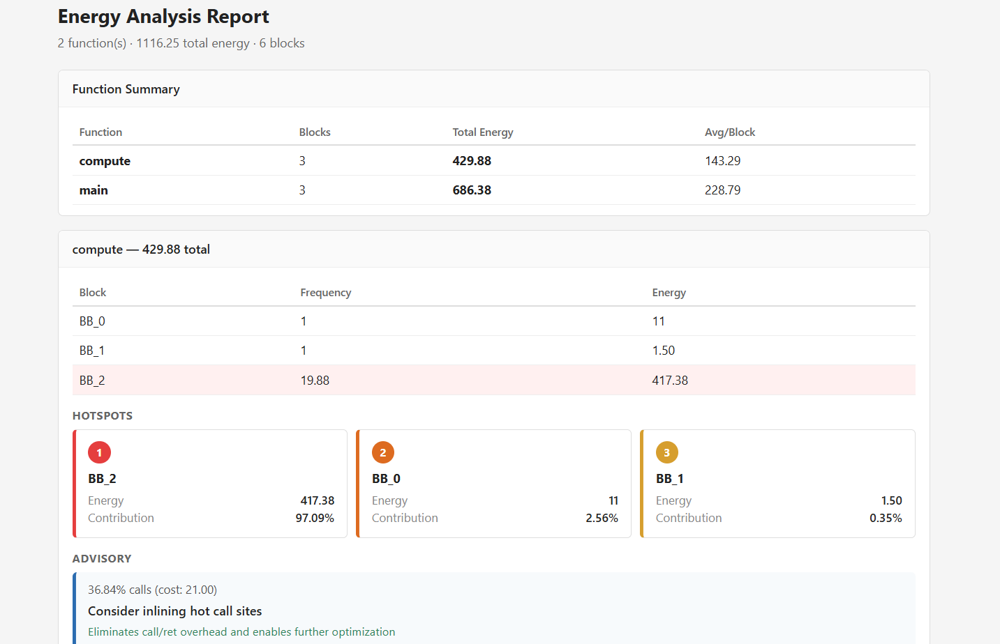
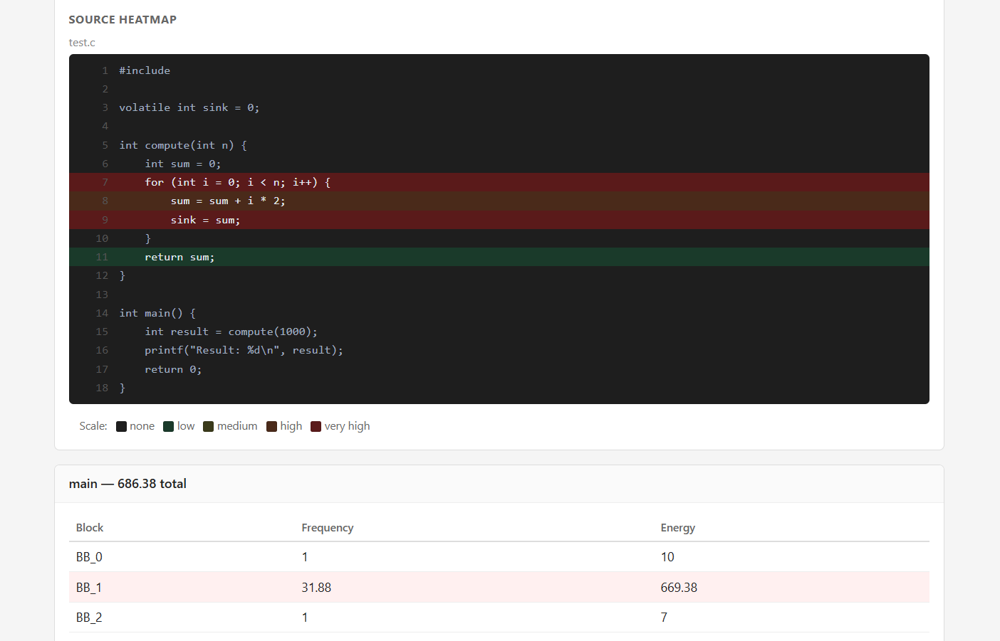
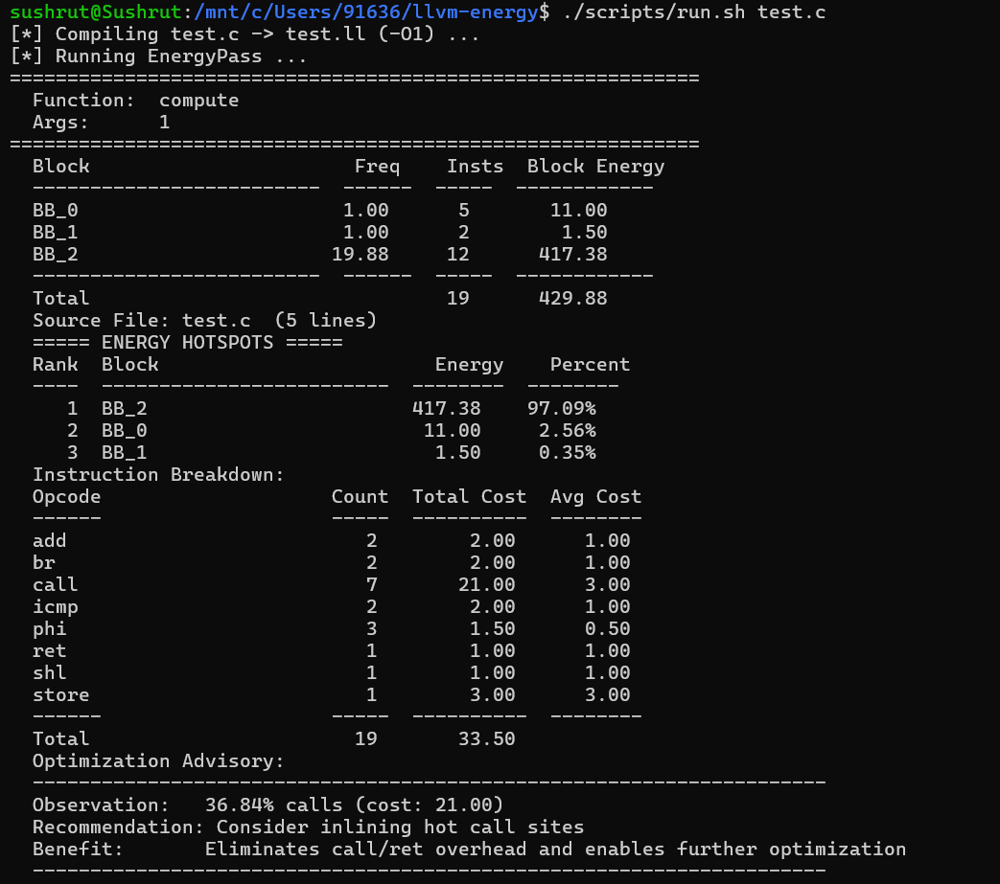
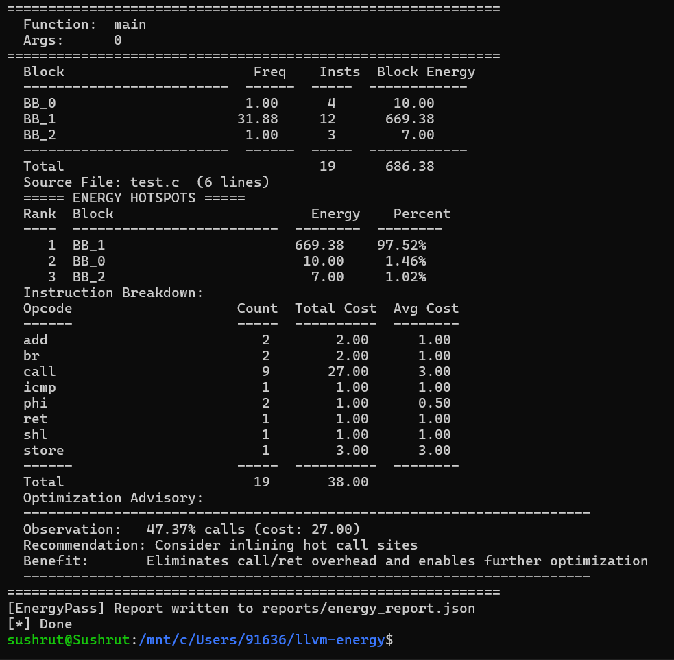
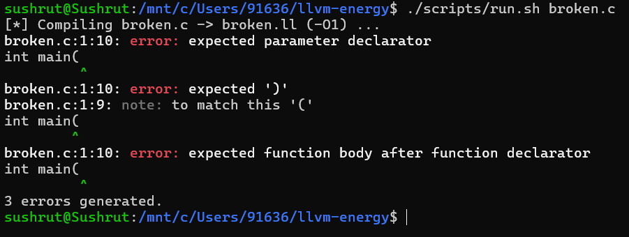

# LLVM Static Energy Estimator

## Overview

An LLVM 14 pass that estimates relative energy consumption of C programs at the basic-block level. Uses block frequency analysis (BFI) to weight instruction costs. Outputs terminal tables, JSON reports, and an HTML source heatmap.

## Features

- Function-wise energy estimation
- Basic-block hotspot detection
- JSON report generation
- HTML visualization
- Optimization suggestions

## Requirements

- LLVM 14
- C++17
- Python 3

## Build

```
./scripts/build.sh
```

Produces `EnergyPass.so`.

## Run

```
./scripts/run.sh test.c
```

## Sample Output

```
===== ENERGY HOTSPOTS =====
Rank  Block                        Energy    Percent
----  -------------------------  --------  --------
   1  BB_2                       620.00    53.91%
   2  BB_1                       256.00    22.26%
   3  BB_3                       248.00    21.57%
```

## Demo Screenshots

Sample outputs from the energy estimation pass:

-  — HTML report dashboard showing energy hotspots
-  — Source code heatmap with line-level energy coloring
-  — Terminal output from running the pass
-  — Terminal output showing instruction breakdown
-  — Example of an edge case or failure mode

## Project Structure

```
llvm-energy/
├── EnergyPass.cpp            # LLVM pass implementation
├── models/
│   └── x86_energy.json       # Opcode cost model (41 opcodes)
├── benchmarks/
│   ├── loop.c                # Arithmetic tight loop
│   ├── matrix.c              # 64×64 matrix multiply
│   ├── memory.c              # Linked-list traversal
│   ├── recursion.c           # Recursive factorial
│   └── sorting.c             # Bubble sort array
├── scripts/
│   ├── build.sh              # Build the pass
│   ├── run.sh                # Compile + run on source file
│   ├── visualize.py          # HTML report generator
│   └── run_benchmarks.sh     # Run all benchmarks
├── demo/
│   ├── dashboard.png         # HTML report screenshot
│   ├── heatmap.png           # Source code heatmap
│   ├── terminal_run1.png     # Sample terminal run
│   ├── terminal_run2.png     # Another terminal run
│   └── failure_case.png      # Example of incorrect output
├── README.md
├── DESIGN.md
├── IMPLEMENTATION.md
└── EVALUATION.md
```

## Limitations

- Uses a static energy model
- Estimates relative energy only
- Not validated using physical power measurements
